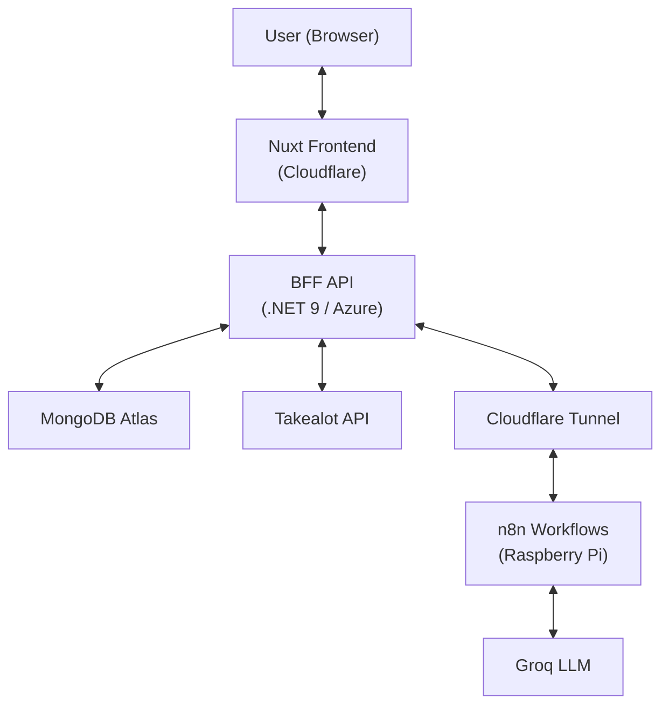
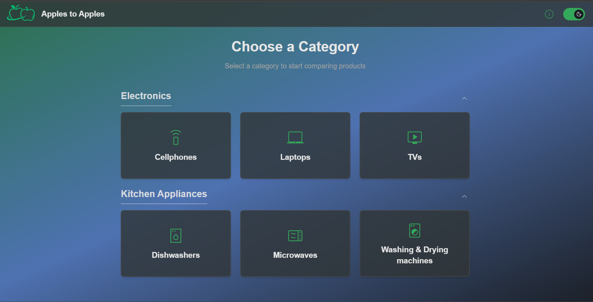
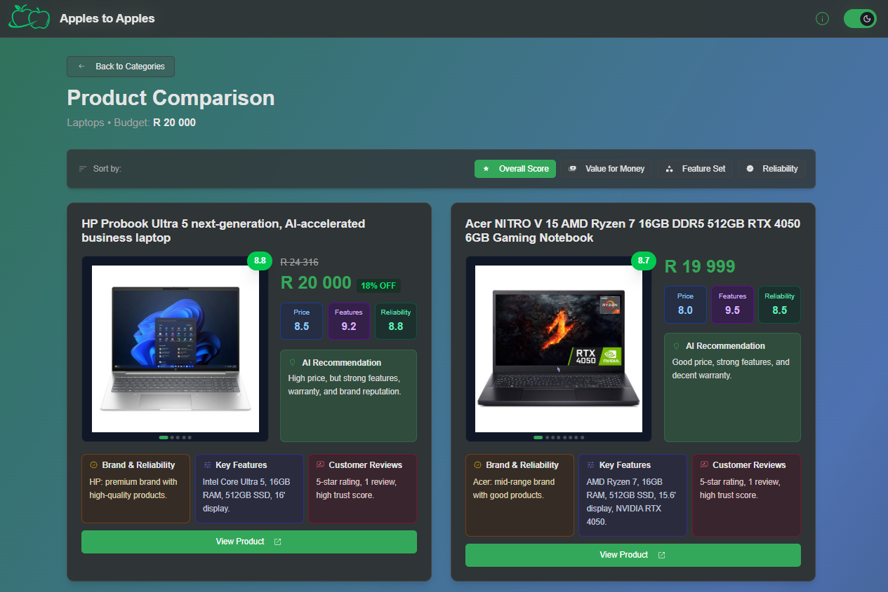

# 🍎 Apples to Apples - Smart Shopping for South Africa

> **AI-powered product comparison platform** that cuts through the noise and helps South African shoppers make informed purchasing decisions through intelligent product scoring, multi-retailer data aggregation, and AI-generated summaries.

[](https://nuxt.com)
[](https://vuejs.org/)
[](https://www.typescriptlang.org/)
[](https://tailwindcss.com)
[](https://www.cloudflare.com/)

---

## 🔗 Live Demo

**[View Live Application](https://apples-to-apples-web.pages.dev/)**

---

## 📋 Table of Contents

- [Overview](#overview)
- [Features](#features)
- [Tech Stack](#tech-stack)
- [Architecture](#architecture)
- [Getting Started](#getting-started)
- [Project Structure](#project-structure)

---

## Overview

**Apples to Apples** helps South African shoppers cut through the noise when comparing products online. Instead of juggling multiple retailer tabs and reviews, users get AI-generated summaries, intelligent product scoring based on price, features, and brand quality, and side-by-side comparisons—all in one place.

The system aggregates data from online retailers (currently Takealot), processes it through an n8n workflow running on a Raspberry Pi, and uses Groq's LLM to generate concise product summaries. The frontend is built with Nuxt for fast SSR performance, the backend runs on .NET 9 in Azure, and everything is connected via a Cloudflare Tunnel for secure access to the self-hosted n8n instance.

---

## Features

- **AI-Powered Summaries** — Groq LLM generates concise product overviews via n8n workflows
- **Smart Scoring** — Multi-factor algorithm evaluates price, features, and brand quality
- **Clean Comparisons** — Side-by-side product views with all relevant data
- **SSR Performance** — Fast initial loads with Nuxt server-side rendering
- **Mobile-First UI** — Responsive design with Tailwind CSS and Shadcn components

---

## Tech Stack

### Frontend (This Repository)
- **Framework**: Nuxt 4.2 (Vue 3.5 with SSR capabilities)
- **Language**: TypeScript
- **Styling**: Tailwind CSS 4.1 with custom configurations
- **Component Library**: Shadcn-vue (Radix UI primitives)
- **Icons**: Lucide Vue Next
- **State Management**: VueUse composables
- **Deployment**: Cloudflare Pages

### Supporting Infrastructure
- **Backend API**: .NET 9 (C#) hosted on Azure — [Backend Repository](https://github.com/DanMiller360/apples-to-apples-bff)
- **Database**: MongoDB Atlas (Cloud)
- **AI Workflow Engine**: n8n (self-hosted on Raspberry Pi)
- **LLM Provider**: Groq (free tier)
- **Networking**: Cloudflare Tunnel for secure n8n exposure
- **API Documentation**: Scalar

---

## Architecture



**Infrastructure**: Cloudflare Pages (Frontend) • Azure (Backend) • MongoDB Atlas (Database) • Raspberry Pi + Cloudflare Tunnel (n8n)

**Data Flow**: User request → Nuxt frontend → .NET backend API → Takealot API + MongoDB + n8n workflow → Groq AI → Response with enriched data

---

## Getting Started

```bash
# Install dependencies
npm install

# Configure environment
echo "NUXT_PUBLIC_API_BASE_URL=https://your-backend-api.azurewebsites.net" > .env

# Run development server
npm run dev
```

**Available Scripts**
- `npm run dev` — Development server
- `npm run build` — Production build
- `npm run preview` — Preview production build
- `npm run lint` — Lint code

---

## Technical Notes

**Interesting Bits**
- Self-hosted n8n on Raspberry Pi with Cloudflare Tunnel for secure public access (no exposed ports)
- Hybrid SSR/CSR rendering in Nuxt for optimal performance per route
- Type-safe API contracts between frontend and backend
- Groq free tier optimization to minimize API costs

**Future Plans**
- Add more retailers (Makro, Game, Checkers)
- Price tracking with historical data
- User accounts for saved comparisons

---

## Project Structure

```
apples-to-apples-web/
├── app/
│   ├── components/        # Vue components
│   │   └── ui/           # Shadcn UI components
│   ├── pages/            # Nuxt pages (file-based routing)
│   ├── assets/           # CSS and static assets
│   ├── lib/              # Utility functions
│   └── plugins/          # Nuxt plugins
├── public/               # Static files
├── server/               # Server API routes
├── nuxt.config.ts        # Nuxt configuration
├── tailwind.config.js    # Tailwind CSS configuration
└── tsconfig.json         # TypeScript configuration
```

---

## Screenshots

### Product Search


### Product Comparison


---

## License

[MIT](LICENSE)

